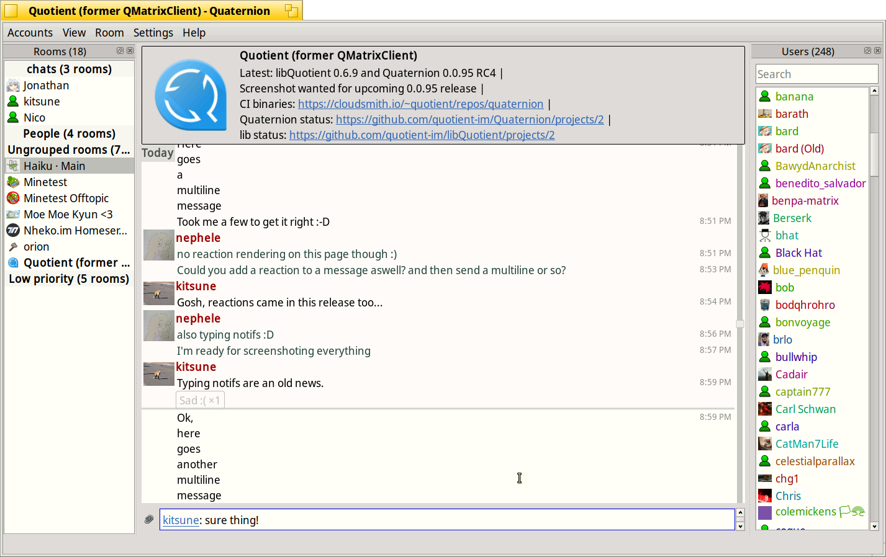

# Quaternion
Quaternion is an IM client for the [Matrix](https://matrix.org) protocol in development.

## Dependencies
- Qt 5
- KDE Framework Core Addons

## Building (Linux)
```
mkdir build
cd build
cmake ../
make
sudo make install
```

## Building (Windows)
I have no idea, but should be possible


## Screenshot

