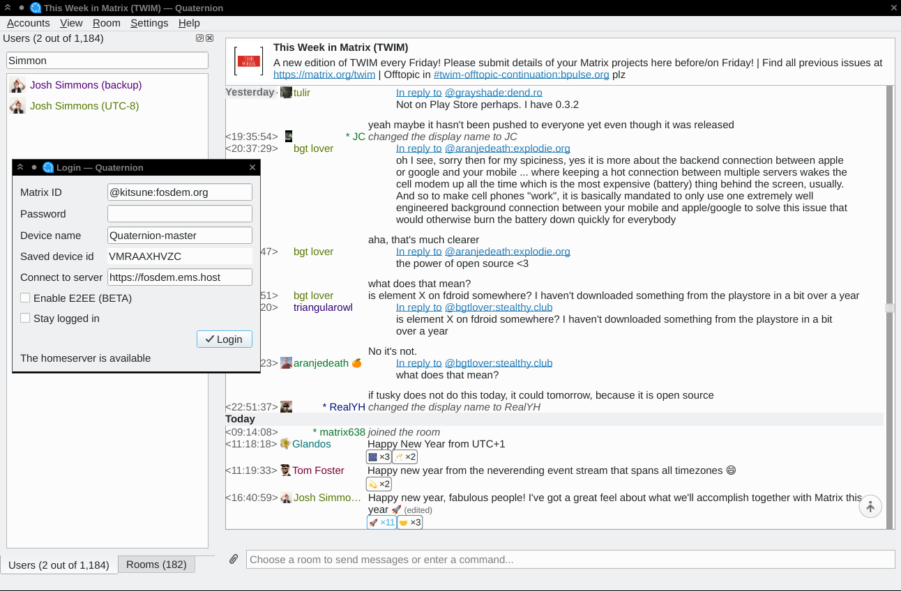
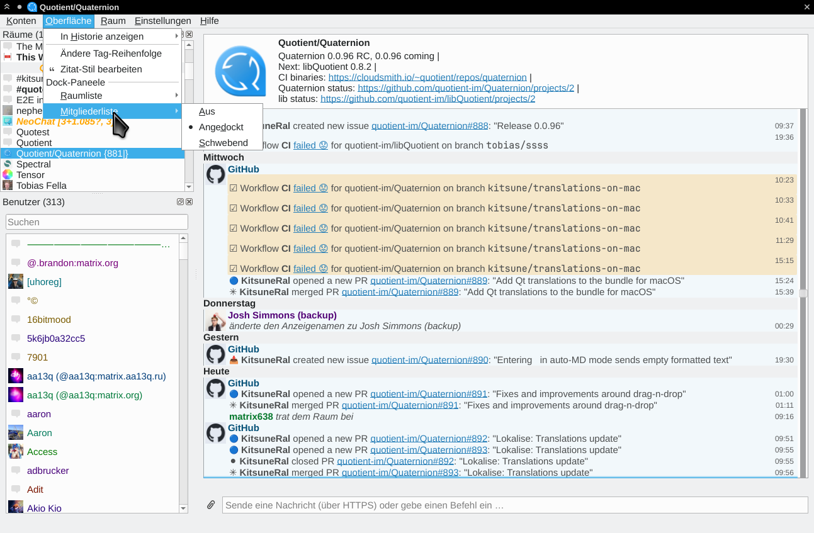

# Quaternion

<!--<a href='https://matrix.org'></a>-->


[](https://github.com/quotient-im/Quaternion/releases/latest)
[](https://www.bestpractices.dev/projects/1663)
[](https://matrix.to/#/#quotient:matrix.org)
[](https://cloudsmith.com)

Quaternion is a cross-platform desktop IM client for the
[Matrix](https://matrix.org) protocol. You can find general information about
application usage and settings here. See [BUILDING.md](./BUILDING.md) for
building instructions.

## Contacts
Most of talking around Quaternion happens in the room of its parent project,
Quotient: [#quotient:matrix.org](https://matrix.to/#/#quotient:matrix.org).
You can file issues at
[the project's issue tracker](https://github.com/quotient-im/Quaternion/issues).
If you find what looks like a security issue, please follow
[special instructions](./SECURITY.md).


## Downloading and installing

The recommended way to install Quaternion is as follows (make sure to read
the notes below depending to your environment):

- on GNU/Linux - using your distribution's package manager;
- on macOS - from Homebrew;
- on Windows - from an archive at the project's
  [GitHub Releases page](https://github.com/quotient-im/Quaternion/releases).

The source code is [hosted at GitHub](https://github.com/quotient-im/Quaternion).

### Requirements

Quaternion 0.0.96 needs Qt version 6.2 or higher, with 5.15
provided as interim for compatibility (6.0, 6.1 are not supported).

### Linux
Quaternion is packaged for many distributions, including various versions of
Debian, Ubuntu and OpenSUSE, as well as Arch Linux, NixOS and FreeBSD.
A pretty comprehensive list can be found at
[Repology](https://repology.org/project/quaternion/versions). Popular
distributions satisfying the mentioned Qt requirement are Debian 11 (Bullseye),
Ubuntu 22.04 (jammy), Fedora 35, OpenSUSE Leap 15.4, anything newer than that
should be fine, too.

There are also flatpaks for Quaternion available from Flathub. To install, use:

```
flatpak install https://flathub.org/repo/appstream/com.github.quaternion.flatpakref
```

These packages are built with a suitable KDE runtime. You can install them on
any distribution that has Flatpak - even if it's older than mentioned above.
Please file issues at https://github.com/flathub/com.github.quaternion
if you believe there's a problem specific to the Flatpak package of Quaternion.

<!-- REMOVE after 0.0.96: AppImages are broken, see #876.
The GitHub Releases page offers AppImage binaries for Linux; however, it's
recommended to only use AppImage binaries if Quaternion is not available
from your distribution's repos and Flatpak doesn't work for you.
Distribution-specific packages better integrate into the system (particularly,
the desktop environment) and include all relevant customisations (e.g. themes)
and fixes (e.g. security). Both Flatpak packages and distribution-specific
packages are built in a more reproducible and controlled way than AppImages
assembled within this project; unlike AppImages, they are also (usually) signed
by the repo which gives certain protection from tampering.
-->

You should not normally need to install anything in addition; if something
is not working due to a missing dependency, it's a bug - please report it.

### Windows
Since there's no established package management on Windows to resolve
dependencies, all needed libraries and a C++ runtime are packaged/installed
together with Quaternion - except OpenSSL. Unless you already have OpenSSL
around (e.g., it is a part of any Qt development installation), you should
install it yourself.
[OpenSSL's Wiki](https://wiki.openssl.org/index.php/Binaries) lists a few links
to OpenSSL installers. They come in different build configurations; current
Quaternion builds need OpenSSL 3.x made with/for Visual Studio (not MinGW).

### macOS
If you use Homebrew (you should!), `brew install quaternion` installs Quaternion
along with its dependencies. Otherwise, packages published at
[GitHub Releases](https://github.com/quotient-im/Quaternion/releases/latest)
come with everything necessary already bundled.

### Development builds

Thanks to generous and supportive folks at [Cloudsmith](https://cloudsmith.io)
who provide free hosting to OSS projects, those who want to check out the latest
(not necessarily the greatest, see below) code can find packages produced by
continuous integration (CI) in the
[Quaternion repo there](https://cloudsmith.io/~quotient/repos/quaternion/groups/).

A few important notes on these packages in case you're new to them:
- All of them come bundled with fairly recent (not necessarily latest) Qt 6.
- They are only provided for testing; feedback on _any_ release is welcome
  as long as you know which build you run; but do not expect the developers
  to address issues in any but the latest snapshot.
- In case it's still unclear: these builds are UNSTABLE by default; some may
  not run at all, and if they do, they may ~~tell you obscenities in your
  local language, steal your smartphone, and share your private photos~~
  scramble the messages you send, interfere with or even break other clients
  including Element ones, and generally corrupt your account in ways unexpected
  and hard to fix (all of that actually happened in the past). Do NOT run these
  builds if you're not prepared to deal with the problems.
- If you understand the above, have your backups in order and are still willing
  to try things out or just generally help with the project - make sure to
  `/join #quotient:matrix.org` and have the URL you downloaded Quaternion from
  handy. In case of trouble, ~~show this label to your doctor~~ send the URL
  to the binary you used in the chat room (you may need to use another client
  or Quaternion version for that), describe what happened and we'll try to pull
  you out of it.

If you want to build Quaternion from sources, see [BUILDING.md](./BUILDING.md).


## Running
Just start the executable in your most preferred way - either from the build
directory or from the installed location. If you're interested in tweaking
configuration beyond what's available in the UI, read the "Configuration"
section further below.


## Translation
Quaternion uses [Lokalise.co](https://lokalise.co) for the translation effort.
It's easy to participate:
[join the project at Lokalise.co](https://lokalise.co/public/730769035bbc328c31e863.62506391/),
ask to add your language (either in
[#quotient:matrix.org](https://matrix.to/#/#quotient:matrix.org) or in
the Lokalise project chat) and start translating! Many languages are still
longing for contributors.


## Configuration
The only non-trivial command-line option available so far is `--locale` - it
allows you to override the locale Quaternion uses (an equivalent of setting
`LC_ALL` variable on UNIX-based systems). Version 0.0.96 comes with German,
Russian, Polish, and Spanish translations.

Quaternion stores its configuration in a way standard for Qt applications, as
described below. It will read and write the configuration in the user-specific
location (creating it if non-existent) and will only read the system-wide
location with reasonable defaults if the configuration is not found at
the user-specific one.

- Linux:
  - user-specific: `$HOME/.config/Quotient/quaternion.conf`
  - system-wide: `$XDG_CONFIG_DIR/Quotient/quaternion` or
    `/etc/xdg/Quotient/quaternion`
- macOS:
  - user-specific: `$HOME/Library/Preferences/im.quotient.quaternion.plist`
  - system-wide: `/Library/Preferences/im.quotient.quaternion.plist`
- Windows: registry keys under
  - user-specific: `HKEY_CURRENT_USER\Software\Quotient\quaternion`
  - system-wide: `HKEY_LOCAL_MACHINE\Software\Quotient\quaternion`

ALL settings listed below reside in `UI` section of the configuration file
or (for Windows) registry.

Some settings exposed in the user interface (Settings and View menus) are:

- `notifications` - a general setting whether Quaternion should distract
  the user with notifications and how.
  - `none` suppresses notifications entirely (rooms and messages are still
    hightlighted but the tray icon is muted);
  - `non-intrusive` allows the tray icon show notification popups;
  - `intrusive` (default) adds to that activation of Quaternion window
    (i.e. the application blinking in the task bar, or getting raised,
    or otherwise demands attention in an environment-specific way).
- `timeline_layout` - this allows to choose the timeline layout. If this is
  set to "xchat", Quaternion will show the author to the left of each message,
  in an xchat/hexchat style. Any other value will select the "default" layout,
  with author labels above blocks of messages.
- `use_shuttle_dial` - Quaternion will use a shuttle dial instead of
  a classic scrollbar for the timeline's vertical scrolling control. To start
  scrolling move the shuttle dial away from its neutral position in the middle;
  the further away you move it, the faster you scroll in that direction.
  Releasing the dial resets it back to the neutral position and stops scrolling.
  This is more convenient if you need to move around without knowing
  the position relative to the edges, as is the case of a Matrix timeline;
  however, the control is somewhat unconventional and not all people like it.
  The shuttle dial is enabled by default; set this to false (or 0) to use
  the classic scrollbar.
- `autoload_images` - whether full-size images should be loaded immediately
  once the message is shown on the screen. The default is to automatically load
  full-size images; set this to false (or 0) to disable that and only load
  a thumbnail in the timeline (with the full image downloaded after you click
  "Save as" or "Open" in the context menu). Check out
  https://github.com/quotient-im/Quaternion/issues/601 for the caveat.
- `show_noop_events` - set this to 1 to show state events that do not alter
  the state (you'll see "(repeated)" next to most of those).
- `RoomsDock/tags_order` - allows to alter the order of tags in the room
  list. This is a comma-separated list of tags/namespaces;
  a few characters have special meaning as described below. If a tag is
  not mentioned and does not fit any namespace, it will be put at the end of
  the room list in lexicographic order. Tags within the same namespace are
  also ordered lexicographically.
  
  `.*` (only recognised at the end of the string) means the whole namespace;
  strings that don't end with this are treated as fully specified tags.
  
  `-` in front of the tag/namespace means it should not be used for grouping;
  e.g., if you don't want People group you can add `-im.quotient.direct`
  anywhere in the list. `im.quotient.none` ("Rooms") always exists and
  cannot be disabled, only its position in the list is taken into account.
  
  The default tags order is as follows:
  `m.favourite,u.*,im.quotient.direct,im.quotient.none,m.lowpriority`,
  meaning: Favourites, followed by all user custom tags, then People,
  rooms with no enabled tags (the "Rooms" group) and finally Low priority
  rooms. If Quaternion doesn't find the setting in the configuration it
  will write down this line to the configuration so that you don't need
  to enter it from scratch.

Settings not exposed in UI:

- `show_author_avatars` - set this to 1 (or true) to show author avatars in
  the timeline (default if the timeline layout is set to default); setting this
  to 0 (or false) will suppress avatars (default for the XChat timeline layout).
- `suppress_local_echo` - set this to 1 (or true) to suppress showing local
  echo (events sent from the current application but not yet confirmed by
  the server). By default local echo is shown.
- `animations_duration_ms` - defines the base duration (in milliseconds) of
  animation effects in the timline. The default is 400; set it to 0 to disable
  animation.
- `outgoing_color` - set this to the color name you prefer for text you sent;
  HTML color names and SVG `#codes` are supported; by default it's `#204A87`
  (navy blue).
- `highlight_color` - set this to the color name you prefer for highlighted
  rooms/messages; HTML color names and SVG `#codes` are supported;
  by default it's `orange`.
- `highlight_mode` - set this to `text` if you prefer to use the text color
  for highlighting; the default is to use the background for highlighting.
- `use_human_friendly_dates` - set this to false (or 0) if you do NOT want
  usage of human-friendly dates ("Today", "Monday" instead of the standard
  day-month-year triad) in the UI; the default is true.
- `quote_style` - the quote template. The `\\1` means the quoted string.
  By default it's `> \\1\n`.
- `quote_regex` - set to `^([\\s\\S]*)` to add `UI/quote_style` only at
  the beginning and end of the quote. By default it's `(.+)(?:\n|$)`.
- `Fonts/render_type` - select how to render fonts in Quaternion timeline;
  possible values are "NativeRendering" (default) and "QtRendering".
- `Fonts/family` - override the font family for the whole application.
  If not specified, the default font for your environment is used.
- `Fonts/pointSize` - override the font size (in points) for the whole
  application. If not specified, the default size for your environment is used.
- `Fonts/timeline_family` - font family (for example `Monospace`) to
  display messages in the timeline. If not specified, the application-wide font
  family is used.
- `Fonts/timeline_pointSize` - font size (in points) to display messages
  in the timeline. If not specified, the application-wide point size is used.
- `maybe_read_timer` - threshold time interval in milliseconds for a displayed
  message to be considered as read.
- `hyperlink_users` - set this to false (or 0) if you do NOT want to
  hyperlink matrix user IDs in messages. By default it's true.
- `auto_markdown` (EXPERIMENTAL) - since version 0.0.95 Quaternion has
  experimental support for Markdown when entering messages. Quaternion only
  treats the message as Markdown if the message starts with `/md` command (the
  command itself is removed from the message before sending). Setting
  `auto_markdown` to `true` enables Markdown parsing in all messages that
  _do not_ start with `/plain` instead. By default, this setting is `false`
  since the current support of Markdown by Qt is buggy, and the implementation
  in Quaternion has its own quirks on top of that. If you have it enabled
  (or use `/md` command) feel free to submit bug reports at the usual place.
- `paste_plaintext_by_default` - set this to false (or 0) if you want to paste
  formatted text by default.

Quaternion uses Qt Keychain to store access tokens and database pickles. If
the secure storage supported by Qt Keychain is not available, Quaternion
will not be able to store your access token(s) and pickles and will
automatically disable E2EE to avoid unrecoverable encrypted messages.
The fallback file used by Quaternion pre-0.0.96 is no more used.

Quaternion caches the rooms state and user/room avatars on the file system
in a conventional location for your platform, as follows:

- Linux: `$HOME/.cache/Quotient/quaternion`
- macOS: `$HOME/Library/Cache/Quotient/quaternion`
- Windows: `%LOCALAPPDATA%/Quotient/quaternion/cache`

Cache files are safe to delete at any time but Quaternion only looks for them
when starting up and overwrites them regularly while running; so it only
makes sense to delete cache files when Quaternion is not running. If Quaternion
doesn't find or cannot fully load cache files at startup it downloads
the whole state from Matrix servers. It tries to optimise this process by
lazy-loading room members if the server supports that; in an unlucky case when
the server cannot do lazy-loading, initial sync can take much time (up to
a minute and even more, depending on the number of rooms and the number of users
in them).

Deleting cache files may help with problems such as missing avatars,
rooms stuck in a wrong state etc.


## Troubleshooting

Quaternion uses libQuotient under the hood; some Quaternion problems are
actually problems of libQuotient. If you haven't found your case below, check
also the troubleshooting section in libQuotient README.md.

#### No E2EE support
If you don't see "Enable E2EE (BETA)" box in the login window, it means that
your Quaternion build does not support E2EE at all. Work with the packager if
you use a package, or build Quaternion with E2EE support (see
[BUILDING.md](./BUILDING.md)) to make it possible.

#### Older messages don't get decrypted in E2EE rooms
Unfortunately, this is a limitation in the current libQuotient code: it doesn't
request older keys and therefore cannot decrypt older messages. Check
[issue 608](https://github.com/quotient-im/libQuotient/issues/608) for
the progress on this.

#### No messages in the timeline
If Quaternion runs but you can't see any messages in the chat (though you can
type them in) - you might not have Qt Quick libraries and/or plugins installed.
On Linux, this may be a case when you are not using the official packages for
your distro. Check the stdout/stderr logs, they are quite clear in such cases.
On Windows, Mac, and when using Flatpak, just open an issue (see "Contacts"
in the beginning of this file) because most likely not all necessary Qt parts
were packaged along with Quaternion.

#### SSL problems
Especially on Windows, if Quaternion starts up but upon an attempt to connect
returns a message like "Failed to make SSL context" - correct SSL libraries
are not reachable by the Quaternion binary. Re-read the chapter "Requirements",
section "Windows" in the beginning of this file and do as it advises (make sure
in particular that you use the correct version of OpenSSL - it should be 3.x,
not 1.x).

#### Logging
If you want to see log messages in the command-line console (by default,
they are sent to system log on Windows and some but not all Linux systems with
journald), set `QT_ASSUME_STDERR_HAS_CONSOLE=1` to force the output to be
redirected to the console.

When chasing bugs and investigating crashes, it helps to run Quaternion from
the command line with increased logging level. Both libQuotient and (since
0.0.96 beta 4) Quaternion use
[logging categories](https://doc.qt.io/qt-6/qloggingcategory.html#configuring-categories)
to allow fine-grained switching of logs for a given part of the code. Quaternion
and libQuotient use different categories; this text only describes those for
Quaternion, make sure to also check [lib/README.md](lib/README.md) for
libQuotient logging categories. The most practical way to configure logging in
order to debug a problem is via the `QT_LOGGING_RULES` environment variable;
the Qt documentation (see the link above) lists a few other methods. In all
cases, you need to provide one or several clauses that look as follows:
```
quaternion.<category>.<level>=<flag>
```
where
- `<category>` is one of (see also `client/logging_categories.h`):
  - `main`
  - `accountselector`
  - `models` (Quaternion backend for user and room lists)
  - `models.events` (same for events)
  - `timeline` (C++ code for timeline visuals - very few log lines and not very
    informative unless you know what to look for)
  - `timeline.qml` (QML code for timeline visuals - this is what you likely
    need to figure out why the timeline looks wrong)
  - `htmlfilter` (conversions between Qt and Matrix subsets of HTML as well
    as HTML import from other applications)
  - `messageinput` (message entry box)
  - `thumbnails` (the code to supply images for the timeline)
- `<level>` is one of `debug`, `info`, and `warning`;
- `<flag>` is either `true` or `false`.

Bear in mind that all logging categories for Quaternion start with `quaternion`
while logging categories for libQuotient always start with `quotient`.

You can use `*` (asterisk) as a wildcard for any part between two dots, and
a semicolon is used for a separator. Latter statements override former ones, so
if you want to switch on all debug logs except `timeline.qml` you can set
```shell script
QT_LOGGING_RULES="quaternion.*.debug=true;quaternion.timeline.qml.debug=false"
```

You may also want to set `QT_MESSAGE_PATTERN` to make logs slightly more
informative (see https://doc.qt.io/qt-6/qtlogging.html#qSetMessagePattern
for the format description). My (@kitsune's) `QT_MESSAGE_PATTERN` looks as
follows:
```
`%{time h:mm:ss.zzz}|%{category}|%{if-debug}D%{endif}%{if-info}I%{endif}%{if-warning}W%{endif}%{if-critical}C%{endif}%{if-fatal}F%{endif}|%{message}`
```
(the scary `%{if}`s are just encoding the logging level into its initial letter).

## Screenshot


